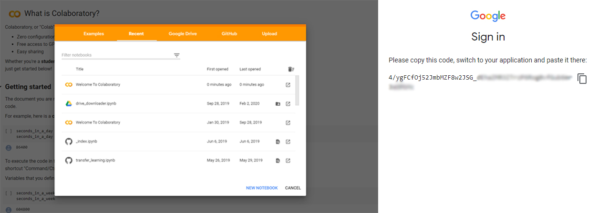

# Google-Drive-Downloader
Download any files directly to the google drive. It uses Google Colab to download files. If you need to save the files from some website to drive then you have to download it and then uplaod it. This becomes very difficult when the file size is too large. This method solves the issue by directly downloading the file to drive, also at very high speed.

# Setup:
* Open [Google Colab](https://colab.research.google.com/notebooks).
* Create a new notebook.
* Connect to the Drive and create a mount point. For that, authentication is required.
  ``` Python
  from google.colab import drive
  drive.mount('/content/drive', force_remount = True)
  ```
  For authentication, choose an account to link then allow access to the Drive. It will generate the auth key, which needs to be entered in the Colab notebook.
  
* Use Linux bash commands to create a folder in our Drive. Colab or Jupyter notebook can run all the bash commands directly through the notebook. The below code will create a **folder "Download"** in the root directory of Drive. **Remember not to change "My Drive", it is the root directory of Google Drive.**
  ``` python notebook
  !mkdir "/content/drive/My Drive/Download"
  ```
* Use wget command to download the file to **Download** folder.
    ``` python notebook
  !wget -O '/content/drive/My Drive/Download/img1.jpg' "https://unsplash.com/photos/u159a2eL6UE/download?force=true"
  ```
  general syntax to download: 
   ``` python notebook
  !wget -O '/content/drive/My Drive/Download/file_name.ext' "download_url"
  ```
  where `file_name.ext` is the required name of the file and .ext represent the respective extention. Example: 
  ```
  Img.jpg 
  my_pic.png
  software.exe
  my_collection.zip
  ```
  and replace `download_url` with the url of the file. 

**Note: If you can get a download link, which is in most of the cases, you will able to download the file. But sometime it may be challenging to get the download link.** 

# Example
In this repo, find `downloader.ipynb` as an example notebook. You can check more details of `wget` command [here](https://www.computerhope.com/unix/wget.htm#syntax).
